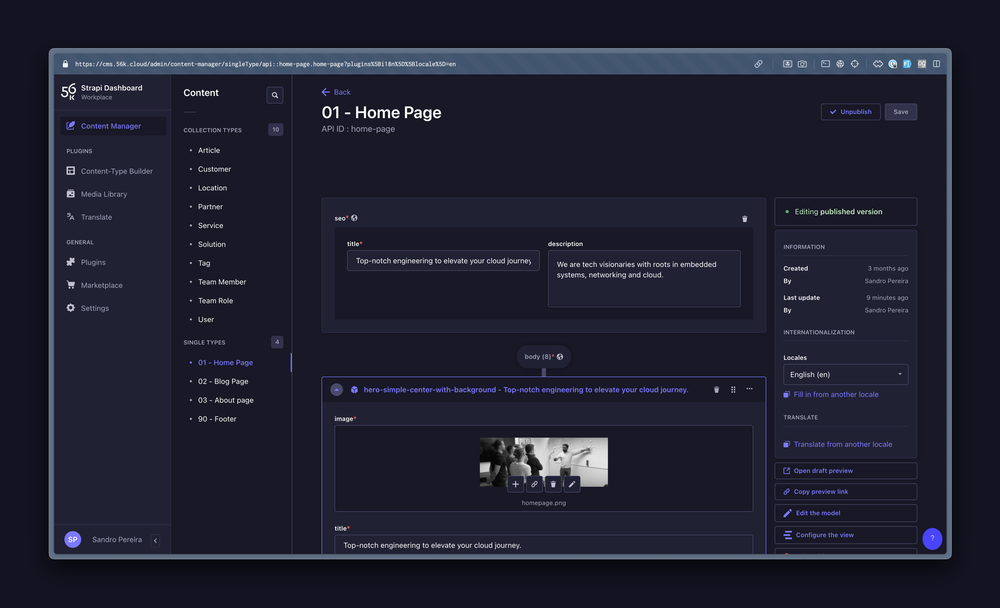
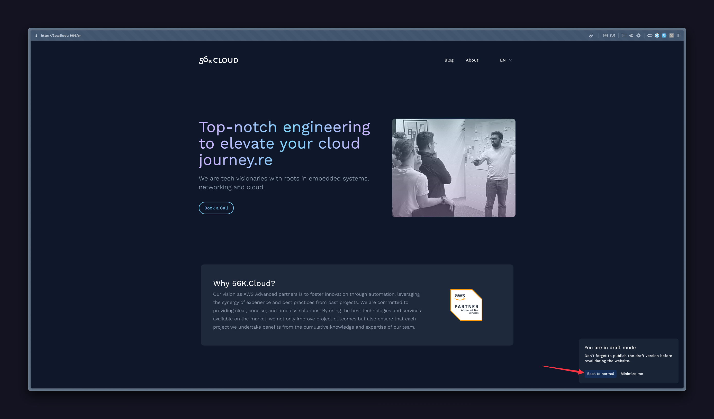

# Development

## Prerequisites

Ensure you have Node v18 or higher installed, as earlier versions haven't been tested.

Next, install the project dependencies with the following command:

    npm i

Before running any commands, set up your environment variables.

## Running the Development Servers

To start the website development server, execute the following command:

    npm run dev:website

To start the CMS development server, execute the following command:

    npm run dev:cms

# Content Creation

## Adding Content to the Website

Follow the steps below to manage content:

1. Log into the Strapi dashboard here: [https://cms.56k.cloud](https://cms.56k.cloud). If you don't have an account, request one in the #56k-website slack channel.

2. Navigate to the Content Manager section, either by clicking on the tab or by following this link: [https://cms.56k.cloud/admin/content-manager](https://cms.56k.cloud/admin/content-manager)

   

   Note, the items list is split into two categories:

   - **Collection types** manage multiple entries, which you can create, edit, and delete in production.
   - **Single types** manage a single entry, which you can edit and delete in production. However, creation is restricted to development mode.

## Creating an Entry in a Collection Type

To create a new solution, for instance, proceed as follows:

1. Navigate to: Content Manager -> Solution -> Create new entry.
   
2. Fill in the form and save. You can then preview it before deploying the website, clicking on the `Open draft preview` button.
   (If the type is already published, it will automatically revalidate the website when you save it)
   
3. Click on the "Publish" button when you are happy with the result.
   

## Updating a Single Type

To update a single type, like creating a new solution:

1. Navigate to: Content Manager -> 01 - Home page.
   
2. Make your desired changes to the fields and save your changes. Then you can preview your page before deploying, by clicking on the `Open draft preview` button.
   
3. Click on the "Publish" button when you are happy with the result.
   

## Disabling Draft Mode

By clicking the `Open Draft Preview` button, you will replace the currently cached content with the latest updates you've made in the CMS. To revert back click on the back to normal button in the draft modal.

## Revalidate Website content

Once you're satisfied with the changes viewed in preview mode and have published the elements you want to deploy, proceed to confirm your content updates by clicking on "Publish".

